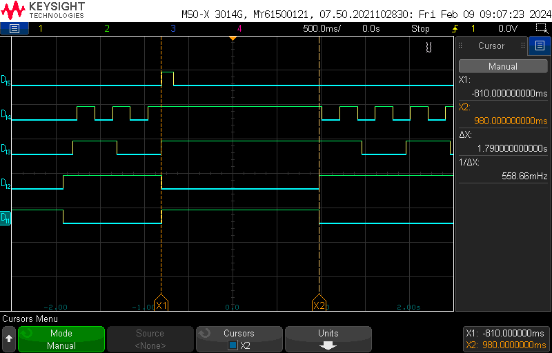
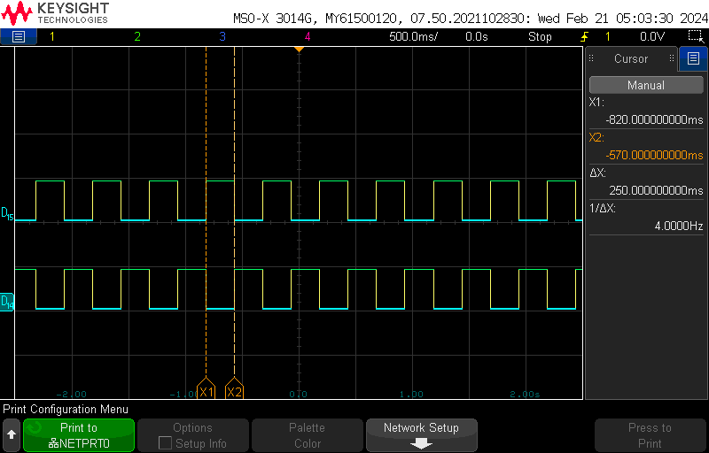
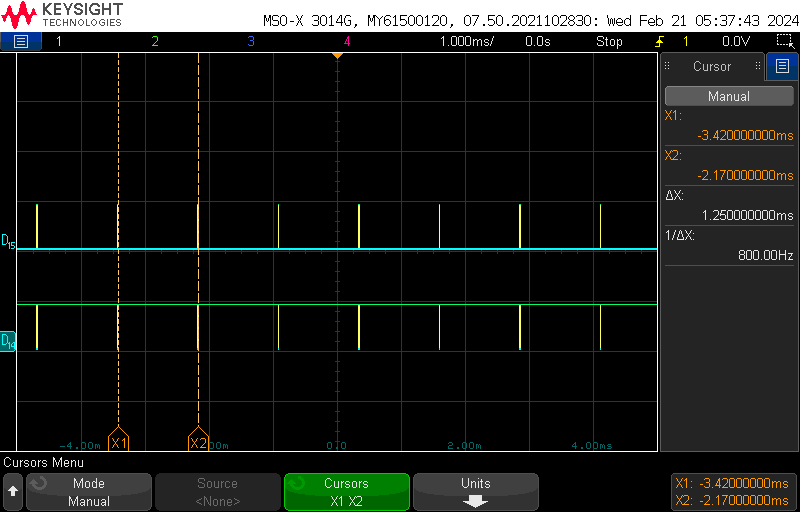
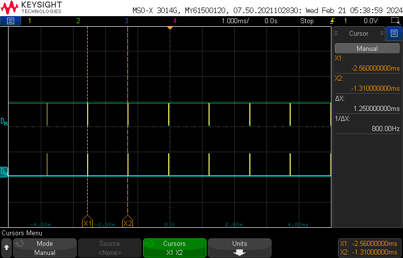
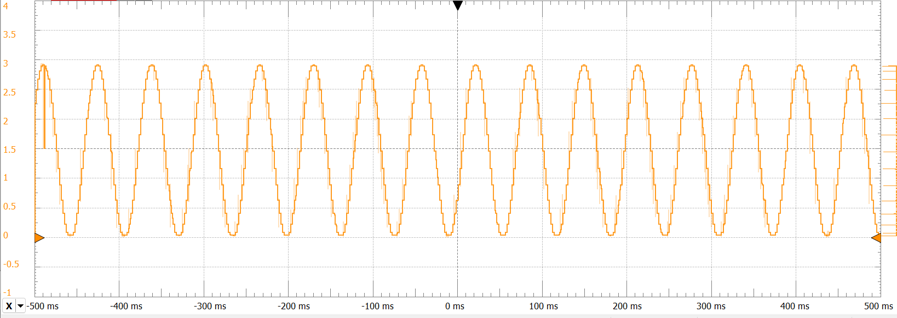

# ECE 6780 Embedded System Design - Labs
University of Utah

David Venegas

# Lab 1: [General-purpose I/Os (GPIO)](6780_lab1_GPIO)
These exercises explore two basic operations of the GPIO: Blinking LEDs, and reading the state of a
pushbutton.

### 1.5.1.a Configuring a GPIO Pin to Output and Blink an LED
Recreate the blinking demo using the green and orange LEDs on the Discovery board:

- [Blinking with ORANGE and GREEN LED's main.c](<6780_lab1_GPIO/Main files/Main ORANGE and GREEN/main.c>)

### 1.5.1.b Changing to the New LEDs
Recreate the blinking demo using the red and blue LEDs on the Discovery board:

- [Blinking with RED and BLUE LED's main.c](<6780_lab1_GPIO/Main files/Main RED and BLUE/main.c>)

### 1.5.2 Configuring a GPIO Pin to Input and Reading a Button
Change your version of the flashing LED program so that each button press toggles the LEDs instead
of the delay:

- [Input and reading a button main.c](<6780_lab1_GPIO/Main files/Main Button/main.c>)

# Lab 2: [Interrupts](6780_lab2_Interrupts)
This lab introduces the concept of interrupt-driven programming and guides through the configuration of interrupt-oriented peripherals; the exercises herein provide a foundation for utilizing interrupts in an embedded application. They introduce the practice of enabling, configuring parameters and writing handler routines to service peripheral interrupt requests.

### 2.6.3 Setting up Interrupt Handler and 2.6.5 and Interrupt Nesting
Although in some cases it may be infeasible, normally you want to keep interrupt handlers as short as possible to avoid starving parts of your program. This exercise demonstrates how a long running interrupt impacts the main application loop.

- [main.c](<6780_lab2_Interrupts/Core/Src/main.c>)

- [stm32f0xx_it.c](<6780_lab2_Interrupts/Core/Src/stm32f0xx_it.c>)

**From the oscilloscope/logic analyzer: ~1.8 sec of delay**

**$D_{15}$** - Button

**$D_{14}$** - Blue LED

**$D_{13}$** - Red LED                        

**$D_{12}$** - Green LED

**$D_{11}$** - Orange LED

# Lab 3: [Timers](6780_lab3_Timers)
This lab explores when deciding on a timer to use for an application, it is helpful to understand their capabilities and limits to determine their suitability for the task. It also explores PWM and GPIO Alternate Functions.

### 3.1 Using Timer Interrupts
Set up a timer such that the update event (UEV) triggers an interrupt at 4 Hz. Timer peripherals allow for greater flexibility in choosing an interrupt period over manually counting in the SysTick handler.

- [main.c](<6780_lab3_Timers/Sources/First_Experiment/main.c>)

- [stm32f0xx_it.c](<6780_lab3_Timers/Sources/First_Experiment/stm32f0xx_it.c>)

**From the oscilloscope/logic analyzer: f = 4Hz or T = 250ms**

**$D_{15}$** - Green LED

**$D_{14}$** - Orange LED

### 3.2 Configuring Timer Channels to PWM Mode, 3.3 Configuring Pin Alternate Functions, and 3.4 Measuring PWM Output
Set up a timer such that the update event (UEV) triggers an interrupt at 4 Hz. Timer peripherals allow for greater flexibility in choosing an interrupt period over manually counting in the SysTick handler.

- [main.c](<6780_lab3_Timers/Sources/CCRx/main.c>)

- [stm32f0xx_it.c](<6780_lab3_Timers/Sources/CCRx/stm32f0xx_it.c>)

**From the oscilloscope/logic analyzer: For CCRx at 20% of ARR f = 800Hz or T = 1.25ms**

**$D_{15}$** - Blue LED

**$D_{14}$** - Red LED

**From the oscilloscope/logic analyzer: For CCRx at 1% of ARR f = 800Hz or T = 1.25ms**

**$D_{15}$** - Blue LED -----> Dimmer light

**$D_{14}$** - Red LED  -----> Brighter light

**From the oscilloscope/logic analyzer: For CCRx at 100% of ARR f = 800Hz or T = 1.25ms**

**$D_{15}$** - Blue LED -----> Brighter light

**$D_{14}$** - Red LED  -----> Dimmer light

# Lab 4: [Universal Asynchronous Receiver/Transmitter (UART)](6780_lab4_UART)
This lab introduces the fundamentals of data transfer through digital communication interfaces. These
interfaces exist because information is only useful when it is understandable; we must, therefore, have
defined ways (standards) of transmitting and interpreting it.

### 4.9.2 Blocking Transmission
This exercise transmits single characters to the serial terminal on the PC. The character transmission
will be handled in the main loop of the application using a blocking method.

- [Blocking Transmission main.c](<6780_lab4_UART/Sources/Blocking Transmission/main.c>)

### 4.9.4 Blocking Reception
The goal is to develop an application that toggles the correct LED whenever the character matching the first letter of the color is pressed. For example, typing an ‘r’ into the terminal would toggle the red LED.

- [Blocking Reception main.c](<6780_lab4_UART/Sources/Blocking Reception/main.c>)

### 4.9.5 Interrupt-Based Reception
In this final exercise you will use an interrupt to save the received data when it arrives. Additionally you will expand your simple command parser with more complex behavior:
Your command parser must now accept two character commands.

• The first character is a letter matching the one of the LED colors.

• The second character is a number between 0 and 2.

– ‘0’ turns off the LED

– ‘1’ turns on the LED

– ‘2’ toggles the LED

2. Print a command prompt such as “CMD?” when waiting for user input.

3. Entering an unknown character prints an error message and restarts back to the beginning.

4. On a successful command, print a message about which command was recognized.

- [Interrupt-Based Reception main.c](<6780_lab4_UART/Sources/Interrupt-Based Reception/main.c>)

# Lab 5: [The Inter-integrated Circuit Interface (I2C)](6780_lab5_I2C)
I2C (Inter-Integrated Circuit), is a synchronous serial communications bus developed by Philips Semiconductor in 1982. It generally connects lower-speed devices such as sensors to a microprocessor. I2C’s design enables many devices to share a single data connection, and it includes addressing so that each device may enable individually without the need for external enable signals. While multiple speed standards exist for the I2C interface, the most common of these are the original 100 kHz and the 400 kHz fast-mode.

### 5.3 Initializing the I2C Peripheral
In this lab we will be using only the basic operation of the I2C peripheral. Because of this, most
of the control bits can be left in their default state.

- [Checking transmission main.c](<6780_lab5_I2C/Sources/whoiam/main.c>)

### 5.7 Using the I3G4250D to Implement a Rotation Indicator
Now that you have completed basic reading and writing to the sensor, it is time to enable and use the data it produces. Since this lab is teaching basic I2C and not how to control the I3G4250D gyro effectively, you aren’t required to fully initialize the device to use the FIFO buffer and other features. In this section you will be repeatedly reading the sensor’s data registers within the main while loop of your program. Because the sensor only produces data at a defined rate (95 Hz default) you will want to introduce some delay between reads.

- [Gyroscope main.c](<6780_lab5_I2C/Sources/Gyro/main.c>)

# Lab 6: [Analog Signals and the ADC/DAC](6780_lab6_Analog)

### 6.1 Measuring a Potentiometer With the ADC
The goal of this exercise is to use the ADC to measure the position of a potentiometer and display the result using the LEDs on the Discovery board. Each LED will have a threshold voltage/value that will cause it to turn on if the measured output of the ADC exceeds that value; likewise, they should turn off if the value drops below the threshold. When turning the potentiometer so that the output (center) pin’s voltage increases, the LEDs should light up in sequence

-[ADC main.c](<6780_lab6_Analog/Sources/ADC/main.c>)

### 6.2 Generating Waveforms with the DAC
The goal of this exercise is to generate an analog waveform that can be viewed using either an oscilloscope or the analog input of a Saleae logic analyzer. The DAC peripheral will be fed values from one of the lab wave-tables given in the lab.

-[DAC main.c](<6780_lab6_Analog/Sources/DAC/main.c>)

